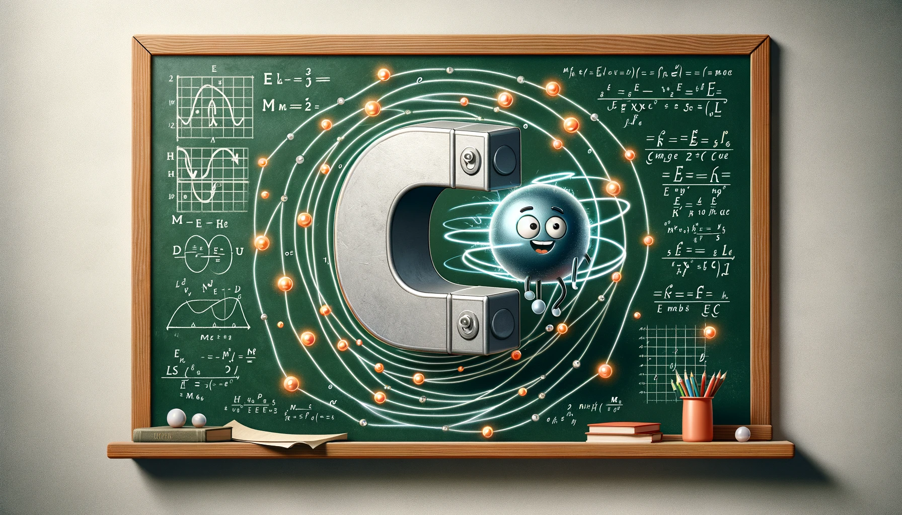

# 02YELMA: Electricity and Magnetism

Welcome to the repository for **02YELMA: Electricity and Magnetism**. Here you can find all the material related with the course.

* If you are taking the course for the first time, reading the [SYLLABUS](./syllabus/main.pdf) is strongly recommended.
* The handwritten lecture notes are mostly derived from the textbook by David J. Griffiths, *Introduction to Electrodynamics* (3th edition). Students are encouraged to read the textbook for a more detailed explanation of the topics covered in the course.
* The homework is provided for self study. Students are not required to return their solutions, but they are encouraged to work on them to better understand the material.

If you wish to download all materials at once, you can click the green `<> Code` button at the top of this repository and select "Download ZIP", or clone the repository via Git.

## Course Materials

| Chapter                             |                       Lecture Notes                       |                            Homework                            |                              Solutions                              |
| :------------------------------------ | :---------------------------------------------------------: | :--------------------------------------------------------------: | :-------------------------------------------------------------------: |
| **1. Mathematical tools**           |      [📝 View Notes](./notes/mathematical-tools.pdf)      |      [📄 View HW](./homework/mathematical-tools/main.pdf)      |    [📝 View Solutions](./solutions/mathematical-tools/main.pdf)    |
| **2. Electrostatics**               |        [📝 View Notes](./notes/electrostatics.pdf)        |        [📄 View HW](./homework/electrostatics/main.pdf)        |      [📝 View Solutions](./solutions/electrostatics/main.pdf)      |
| **3. Electric Fields in Matter**    |  [📝 View Notes](./notes/electric-fields-in-matter.pdf)  |  [📄 View HW](./homework/electric-fields-in-matter/main.pdf)  | [📝 View Solutions](./solutions/electric-fields-in-matter/main.pdf) |
| **4. Magnetostatics**               |        [📝 View Notes](./notes/magnetostatics.pdf)        |        [📄 View HW](./homework/magnetostatics/main.pdf)        |      [📝 View Solutions](./solutions/magnetostatics/main.pdf)      |
| **5. Magnetic Fields in Matter**    |  [📝 View Notes](./notes/magnetic-fields-in-matter.pdf)  |                               -                               |                                  -                                  |
| **6. Electrodynamics**              |       [📝 View Notes](./notes/electrodynamics.pdf)       |       [📄 View HW](./homework/electrodynamics/main.pdf)       |      [📝 View Solutions](./solutions/electrodynamics/main.pdf)      |
| **7. Electromagnetic Waves**        |    [📝 View Notes](./notes/electromagnetic-waves.pdf)    |    [📄 View HW](./homework/electromagnetic-waves/main.pdf)    |   [📝 View Solutions](./solutions/electromagnetic-waves/main.pdf)   |
| **8. Special Theory of Relativity** | [📝 View Notes](./notes/special-theory-of-relativity.pdf) | [📄 View HW](./homework/special-theory-of-relativity/main.pdf) |       [📝 View Solutions](./solutions/special-theory-of-relativity/main.pdf)           |

## Recordings

The lectures are recorded and are available on YouTube: [2025](https://www.youtube.com/playlist?list=PLHcyKkvX9MRPpwlXAppDIPab1iJ0R7Jj-), [2026](https://www.youtube.com/playlist?list=PLHcyKkvX9MRPH8ck_i3LEwDLgVIQksgi1)

